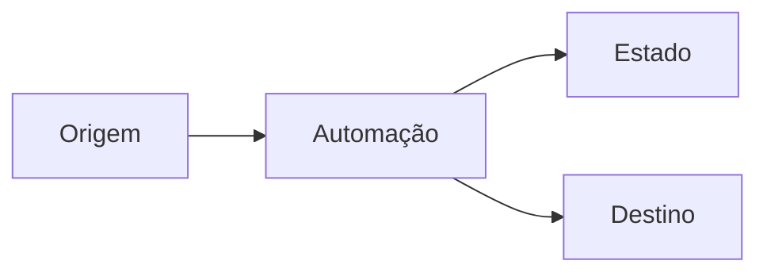

# Automação do método — guardrails e atalhos

Este documento transforma boas práticas em mecanismos concretos. O objetivo é reduzir dependência de memória, cliques e disciplina manual sem criar burocracia desnecessária.

## 1. Constituição de sessão — ADOTADA COM AJUSTE

Ao iniciar trabalho em um projeto relevante, a IA deve procurar primeiro o `AI_CONTEXT.md` e a documentação vigente no repositório, usando conector, API ou URL pública quando disponível.

Não exigir que o usuário cole novamente contexto que já pode ser recuperado.

A IA deve identificar pelo menos:

```text
objetivo
baseline seguro
estado atual
próxima ação concreta
```

A memória persistente, quando disponível, deve guardar preferencialmente ponteiros e regras gerais; o conteúdo técnico detalhado continua versionado no GitHub.

## 2. Guardrails automáticos no GitHub — ADOTADOS

Para repositórios relevantes, principalmente públicos ou de produção, considerar:

- GitHub Actions para validação estática;
- validação de JSON/YAML e outros formatos usados pelo projeto;
- secret scanning e push protection nativos do GitHub quando disponíveis;
- ferramenta adicional como Gitleaks/TruffleHog apenas quando houver ganho real além da proteção nativa;
- branch protection/rulesets para exigir checks antes de merge em projetos de maior risco;
- lint de documentação como melhoria de qualidade, não como bloqueio obrigatório por padrão.

A regra é automatizar proteção que previne erro real, sem adicionar ferramentas apenas por aparência de rigor.

## 3. Gate de mudança baseado em risco — ADOTADO NO LUGAR DE “DIFF OBRIGATÓRIO PARA TUDO”

Não exigir aprovação manual de diff para toda alteração. Isso criaria atrito e conflitaria com automações já autorizadas.

Usar classificação de risco:

### Baixo risco

Exemplos:

- documentação;
- checkpoint;
- changelog;
- correção textual;
- arquivo `.example` sem efeito em produção.

Pode ser atualizado automaticamente quando já houver autorização geral para isso.

### Médio risco

Exemplos:

- código localizado;
- regra de negócio não destrutiva;
- script administrativo de leitura;
- ajuste de configuração não estrutural.

Mostrar escopo, impacto e o que não será alterado. Pedir confirmação quando a consequência não estiver totalmente coberta pela solicitação atual.

### Alto risco

Exemplos:

- produção;
- banco/schema;
- permissões;
- infraestrutura;
- exclusão;
- migração;
- alteração estrutural de fluxo;
- operação em massa.

Antes de escrever:

```text
mostrar diff/impacto esperado
confirmar baseline
confirmar backup/rollback
obter autorização explícita para a escrita se ela ainda não tiver sido dada
```

## 4. Testes derivados do comportamento — ADOTADOS

Sempre que possível, escrever testes a partir do comportamento esperado e não da implementação interna.

Exemplo:

```text
Regra de negócio:
“Executar a mesma operação duas vezes não pode duplicar o registro.”

Teste:
1. executar uma vez
2. executar novamente
3. confirmar apenas um registro final
```

Esses testes funcionam como contrato e sobrevivem melhor a refatorações.

## 5. Arquitetura como código com Mermaid — ADOTADA

Para projetos com vários componentes ou fluxos difíceis de entender apenas por texto, preferir um diagrama Mermaid versionado no `README.md` ou `DOCUMENTO_BASE.md`.

Exemplo:



O diagrama complementa o texto; não substitui contratos, restrições ou detalhes técnicos.

## 6. Conventional Commits — ADOTADO

Usar prefixos consistentes quando fizer sentido:

```text
feat: nova funcionalidade
fix: correção
refactor: reorganização sem mudança de comportamento
docs: documentação
test: testes
chore: manutenção
security: hardening/segurança
```

Automação de release/changelog com ferramentas como `release-please` ou `semantic-release` é opcional.

Não ativar automaticamente em monorepositórios ou projetos com vários produtos sem definir primeiro como cada componente será versionado. Uma automação de release errada pode criar tags e versões sem significado.

## 7. Matriz impacto x esforço — ADOTADA COMO TRIAGEM

Antes de criar estrutura pesada para uma tarefa pequena, classificar rapidamente:

```text
alto impacto + baixo esforço  → priorizar
alto impacto + alto esforço   → planejar formalmente
baixo impacto + baixo esforço → fazer se útil
baixo impacto + alto esforço  → normalmente descartar
```

O documento-base detalhado continua obrigatório para projetos relevantes, não para cada ajuste pequeno.

## 8. Post-mortem para incidentes graves — ADOTADO

`ERROS_CONHECIDOS.md` continua suficiente para falhas comuns.

Para incidente relevante em produção, criar um post-mortem com:

```text
linha do tempo
impacto real
causa raiz
fatores contribuintes
contenção imediata
ação corretiva
ação preventiva
como detectar antes da próxima vez
responsável/prazo quando aplicável
```

O objetivo não é procurar culpados; é transformar incidente em prevenção executável.

## 9. Feature flag / kill switch — ADOTADO COMO PRINCÍPIO, NÃO COMO `config.json` UNIVERSAL

Ter mecanismo para ativar/desativar funcionalidade de risco é útil, mas a implementação depende da arquitetura.

Exemplos adequados:

- campo em lista/configuração central para Power Automate;
- variável de ambiente em backend;
- configuração local versionada para recurso que já exige novo deploy;
- flag remota somente quando a segurança, disponibilidade e autenticação dessa dependência forem justificadas.

Não introduzir leitura remota ou nova infraestrutura apenas para ter uma feature flag.

A prática geral é: **quando uma mudança relevante puder precisar de desligamento rápido, projetar um kill switch proporcional ao risco.**

## 10. Retomada e encerramento automáticos — ADOTADOS

### Ao iniciar

A IA deve recuperar o `AI_CONTEXT.md` e o baseline quando acessíveis, em vez de pedir que o usuário reexplique o projeto.

### Ao encerrar um marco importante

A IA deve, quando tiver acesso autorizado ao repositório:

- registrar checkpoint/changelog;
- atualizar `AI_CONTEXT.md` se o estado vigente mudou;
- registrar teste relevante;
- atualizar baseline quando aprovado;
- deixar a próxima ação concreta.

Não esperar necessariamente que o usuário lembre de pedir esse fechamento.

## 11. Regra geral extraída destas sugestões

Sempre que uma boa prática depender apenas de memória humana, avaliar se ela pode virar:

```text
check automático
preflight
lint
teste
regra de branch
script
template
configuração
checkpoint automático
```

Automatizar a proteção quando o mecanismo for mais simples e confiável que lembrar da regra manualmente.

## 12. O que não foi adotado literalmente

### “Sempre mostrar diff e esperar OK”

Não adotado como regra universal. É burocrático para documentação e tarefas de baixo risco já autorizadas. Foi substituído por gate baseado em risco.

### “Sempre usar Gitleaks ou TruffleHog”

Não adotado como obrigação. Primeiro usar capacidades nativas do GitHub e adicionar ferramenta externa quando houver cobertura adicional justificável.

### “Gerar changelog e release automaticamente em todo projeto”

Não adotado como padrão universal. A automação de release só entra quando a estratégia de versionamento estiver clara.

### “Feature flag sempre em config.json”

Não adotado literalmente. O princípio do kill switch foi aceito, mas a implementação deve respeitar a plataforma.
