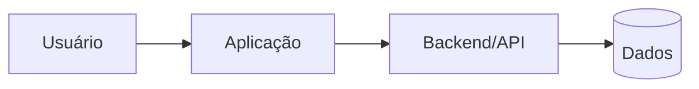

# ARCHITECTURE — Template

## Contexto

[Resumo técnico do sistema e ambiente]

## Escolhas principais

- frontend:
- backend:
- banco:
- autenticação:
- deploy:
- design system:
- testes:

Para cada escolha importante, registrar motivo curto e evitar tecnologia sem necessidade.

## Componentes

Adapte ou remova o diagrama quando não ajudar.

## Fluxo de dados

- ...

## Limites e contratos

- APIs:
- schema:
- integrações:
- permissões:

## Configuração por ambiente

Separar valores variáveis da lógica. Nunca registrar segredos.

## Segurança

- autenticação:
- autorização:
- dados sensíveis:
- secrets:
- privilégio mínimo:

## Observabilidade

Definir apenas o que o projeto precisa para diagnosticar falhas e comportamento.

## Recuperação

Em sistemas existentes ou mudanças de risco, registrar baseline, backup/migration e rollback adequados.

## Decisões substituídas

Não manter alternativas antigas como se ainda fossem vigentes. Referenciar ADR/decisão histórica quando necessário.